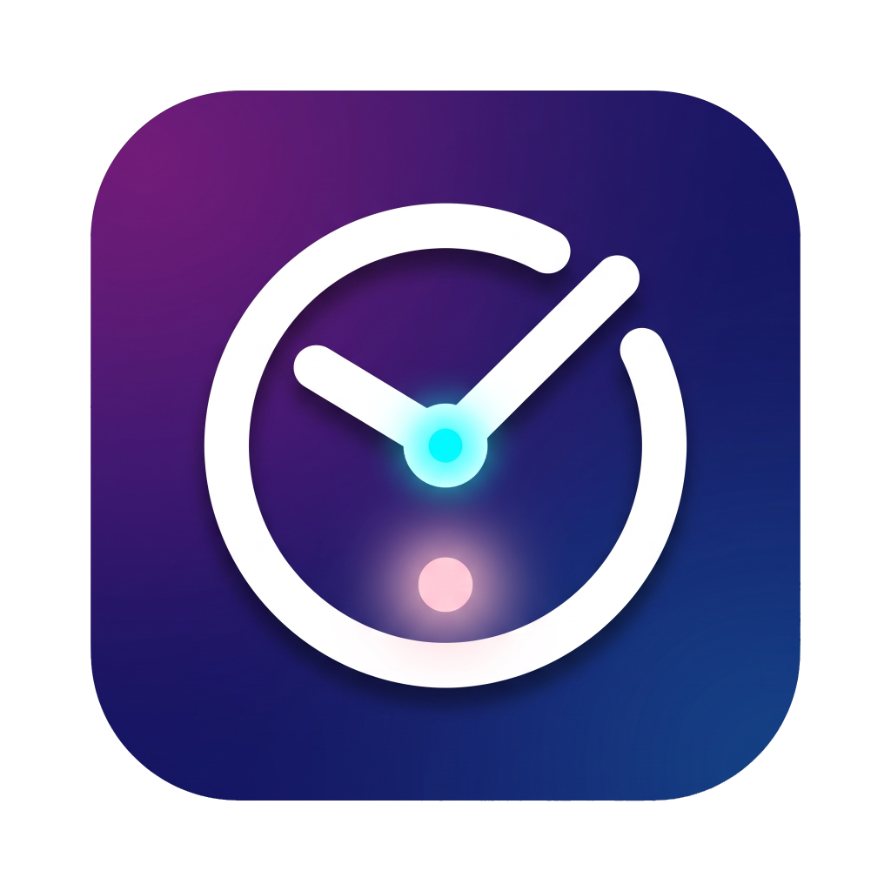

# ⏳ Yakala Zamanı
> **Zamana Meydan Okuyan Geri Sayım ve Etkinlik Takip Platformu**

🌐 **Canlı Demo:** [Yakala Zamanı Canlı İzle](https://kullaniciadi.github.io/yakala-zamani) *(GitHub Pages yayını sonrasında bu bağlantıyı kendi kullanıcı adınızla güncelleyebilirsiniz)*

---

## 📖 Proje Hakkında
**Yakala Zamanı**, Türkiye'deki milli bayramlar, önemli tarihi günler, dini günler ve ÖSYM/MEB tarafından uygulanan merkezi sınavlar (YKS, KPSS, LGS, DGS, ALES, YDS) başta olmak üzere tüm önemli anları saniye saniye takip etmenizi sağlayan, kullanıcı dostu, estetik ve modern bir geri sayım web uygulamasıdır.

Kullanıcıların kendi özel etkinliklerini de ekleyebildiği platform; insan müdahalesine gerek kalmadan günü geçen bayramları, dini günleri ve sınavları otomatik olarak önümüzdeki yıla devreden **akıllı bir takvim motoruna** sahiptir.

---

## ✨ Temel Özellikler
- **Canlı Geri Sayım Sayaçları:** Tüm etkinlikler için gün, saat, dakika ve saniye bazında canlı sayaçlar.
- **Öne Çıkan "Hero" Alanı:** Sayfanın en üstünde, zamana en yakın sıradaki etkinliği büyük sayaçla vurgular.
- **"Vakti Geldi!" Uyarı Eylemi:** Herhangi bir etkinliğin vakti geldiğinde (saat 00:00 veya sınav saatinde) etkinlik kutusu ve yazılar 1 dakika boyunca nazikçe büyüyüp küçülerek (pulse efekti) kutlama ve uyarı bildirimi yapar.
- **Kategori Filtreleme:**
  - Tümü
  - Milli Bayramlarımız
  - Dini Günlerimiz
  - Önemli Günler
  - Sınavlar
  - Özel Etkinliklerim
- **Anlık Arama Çubuğu:** Başlık ve açıklamalara göre anında hızlı filtreleme.
- **Özel Etkinlik Yönetimi:** Modal pencere üzerinden istenen başlık, tarih, saat ve açıklamayla yeni etkinlikler eklenebilir; istenenler tek tıkla silinebilir (Veriler tarayıcının `localStorage` hafızasında saklanır).
- **Tek Tıkla Süre Kopyalama:** Kalan süreyi panoya kopyalayarak mesajlaşma veya sosyal medyada paylaşma kolaylığı.
- **Etkinlik Detay Modalı:** Herhangi bir karta tıklandığında dev sayaç, resmiyet durumu ve bilgilendirici açıklamalar içeren modal pencere.
- **Aydınlık / Karanlık Tema:** Göz yormayan karanlık mod ile aydınlık mod arasında tek tıkla geçiş; kullanıcı tercihi hafızada saklanır.
- **Canlı Sistem Saati:** Header alanında saniyesi saniyesine işleyen canlı dijital saat.

---

## 🔄 Akıllı ve Otomatik Güncellenen Takvim Motoru (Sonsuz Döngü)
Sitenin en güçlü yanı "asla eskimeyen ve manuel müdahaleye ihtiyaç duymayan" bir yapıya sahip olmasıdır:

- **Milli Bayramlar ve Önemli Günler:** 29 Ekim, 23 Nisan, 19 Mayıs, 30 Ağustos, 10 Kasım gibi sabit günler; günü geçtikten sonra otomatik olarak bir sonraki yıla aktarılır. Açıklamadaki yıl sayısı (örneğin *"Cumhuriyetimizin 103. yılı"* $\rightarrow$ *"104. yılı"*) matematiksel olarak yenilenir.
- **Dini Günler ve Kandiller:** Ramazan, Kurban Bayramı, Regaip, Miraç, Berat ve Mevlid Kandilleri ile Kadir Gecesi Hicri takvime göre günü geçince sıradaki yıla otomatik devrolur.
- **Sınavlar (Hibrit Model):**
  - Sınavlar kart üzerinde **`✅ Resmi Tarih (ÖSYM / MEB)`** veya **`⏳ Tahmini Tarih`** rozetleriyle şeffaf şekilde gösterilir.
  - Sınav günü tamamlandığında sistem o sınavı geçmişte bırakmaz; otomatik olarak bir sonraki yılın geleneksel haftasına tahmini tarihle taşır ve durumunu tekrar *"Tahmini Tarih"* yapar.
  - ÖSYM/MEB resmi takvimi açıkladığında kodlara dokunmadan sadece `sinav-takvimi.json` dosyasından tarih girilip `"resmi": true` yapılarak tüm site anında güncellenir.
  - YDS ve ALES oturum sayılarının artması veya eksilmesi durumu tek bir JSON dosyasından yönetilir.

---

## 🛠️ Tasarım ve Teknoloji Altyapısı
- **Çekirdek:** HTML5, CSS3, Vanilla JavaScript (Hiçbir harici ağır kütüphane veya framework gerektirmez; ultra hızlı açılır).
- **Glassmorphism:** Yarı saydam buzlu cam paneller ve modern derinlik efektleri.
- **Ambient Arka Plan:** Pembe, cam göbeği ve mor tonlarında yavaşça süzülen ışıma küreleri.
- **Tipografi:** Google Fonts *Kanit* yazı tipi ailesi.
- **Tam Uyumlu (Responsive):** Mobil, tablet ve masaüstü cihazlarla %100 uyumlu arayüz.

---

## 📁 Proje Dosya Yapısı
```text
yakala-zamani/
├── index.html                  # Web sitesinin ana arayüzü ve HTML iskeleti
├── style.css                   # Ambient ışımalar, cam efektleri ve animasyonlar
├── script.js                   # Sayaçlar, filtreler, modal ve otomatik takvim motoru
├── sinav-takvimi.json          # Resmi ve tahmini sınavların merkezi veri dosyası
├── logo.png                    # "Yakala Zamanı" marka logosu
├── .gitignore                  # Git takip dışı bırakılan dosyalar
├── LICENSE                     # MIT Açık Kaynak Lisansı
└── README.md                   # Proje dokümantasyonu ve kullanım kılavuzu
```

---

## 🚀 Yayınlama ve Kurulum
Proje tamamen statik ve istemci taraflı olduğundan herhangi bir sunucu kurulumu gerektirmez.

1. Depoyu klonlayın veya indirin:
   ```bash
   git clone https://github.com/kullaniciadi/yakala-zamani.git
   ```
2. `index.html` dosyasını doğrudan herhangi bir modern web tarayıcısında açın.
3. Veya GitHub Pages, Vercel, Netlify gibi ücretsiz servislerle anında tüm dünyaya canlı yayına açın.

---

## 📄 Lisans
Bu proje [MIT Lisansı](LICENSE) kapsamında lisanslanmıştır. Detaylar için `LICENSE` dosyasına göz atabilirsiniz.
